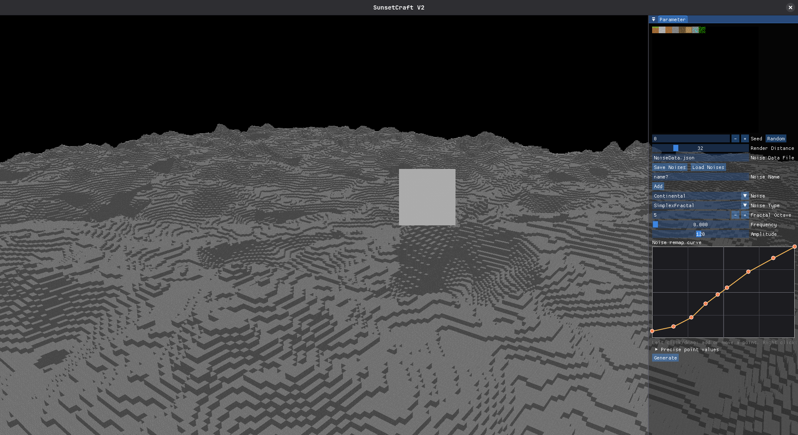

# SunsetCraft V2

> A C++/OpenGL Minecraft-inspired prototype built to experiment. Because I need to continue practicing since I'm not a full developer.


---



---

## Resume

SunsetCraft V2 is a rewrite of [SunsetCraft](https://github.com/SunvyWasTaken/SunsetCraft). The goal is to keep the first version untouched while starting again from a cleaner base to test:

- more expressive world generation, inspired by Henrik Kniberg's [Reinventing Minecraft world generation](https://youtu.be/ob3VwY4JyzE) talk;
- an in-game ImGui noise-parameter editor;
- a local networking layer based on ENet;
- progressive integration with [`SunsetEngine`](https://github.com/SunvyWasTaken/SunsetEngine), the engine used by the project.

---

## Current features

- Main menu with `Start Server`, `Join Server`, and `Quit` actions.
- Local session hosting on port `7777`.
- Local connection to an existing session.
- Chunk-grid generation around the origin.
- Height generation with multiple `FastNoiseSIMD` noise layers.
- ImGui editor for:
    - changing the seed;
    - randomizing the seed;
    - adding and selecting noise layers;
    - choosing the noise type;
    - editing octaves, frequency, and amplitude;
    - editing a noise-value remapping curve;
    - saving and loading noise presets as JSON.
- Legacy network test layer with a small chat UI kept in the codebase.

---

## Project status

- A world can be launched from the menu.
- Server and client sessions can be started locally, but full world replication is not implemented yet.
- Generation is currently centered on a few test chunks to make rendering and noise-parameter iteration easier.
- The default noise configuration file is `NoiseData.json` when it is available in the save path configured by the engine.

---

## Technologies

- C++20
- CMake 3.28+
- OpenGL
- GLFW / GLAD
- GLM
- ImGui with experimental docking
- ENet
- EnTT
- nlohmann-json
- spdlog
- stb
- vcpkg manifest mode
- [`SunsetEngine`](https://github.com/SunvyWasTaken/SunsetEngine) as a Git submodule

---

## Requirements

Before building, install:

- a C++20-compatible compiler;
- CMake `3.28` or newer;
- Git;
- vcpkg;
- the graphics dependencies required for OpenGL on your system;
- Visual Studio, CLion, or another CMake IDE if you prefer working with a graphical environment.

> On Windows, Visual Studio 2022 with the C++ workload is recommended. CLion also works well with CMake and vcpkg.

---

## Installation

### 1. Clone the project with its submodules

```bash
git clone --recurse-submodules <repo-url> SunsetCraft_V2
cd SunsetCraft_V2
```

If the project was already cloned without the [`SunsetEngine`](https://github.com/SunvyWasTaken/SunsetEngine) submodule, run:

```bash
git submodule update --init --recursive
```

### 2. Install or prepare vcpkg

You can follow Microsoft's official documentation:
[Get started with vcpkg](https://learn.microsoft.com/en-us/vcpkg/get_started/get-started-vs?pivots=shell-cmd).

Example local installation next to the project:

```bash
git clone https://github.com/microsoft/vcpkg.git
```

Windows:

```bat
vcpkg\bootstrap-vcpkg.bat
```

Linux / macOS:

```bash
./vcpkg/bootstrap-vcpkg.sh
```

### 3. Configure CMake

Replace the vcpkg toolchain path with the one matching your installation.

Windows:

```bat
cmake -S . -B Build -DCMAKE_TOOLCHAIN_FILE=%CD%\vcpkg\scripts\buildsystems\vcpkg.cmake
```

Linux / macOS:

```bash
cmake -S . -B Build -DCMAKE_TOOLCHAIN_FILE=$PWD/vcpkg/scripts/buildsystems/vcpkg.cmake
```

### 4. Build

```bash
cmake --build Build --config Debug
```

For a Release build:

```bash
cmake --build Build --config Release
```

---

## Running the game

After building, run the `SunsetCraftV2` executable generated in the `Build` directory.

From the main menu:

1. click `Start Server` to host a local session;
2. start a second game instance;
3. click `Join Server` to join the local session;
4. use the `Parameter` window to create, edit, generate, save, or load generation settings.

---

## Project structure

```text
.
├── CMakeLists.txt              # CMake configuration for the executable
├── README.md                   # Project documentation
├── vcpkg.json                  # vcpkg manifest dependencies
├── Ressources/
│   └── ScreenShot/             # Game screenshots
├── Sources/
│   ├── main.cpp                # Application entry point
│   ├── MainMenu.*              # Main menu
│   ├── Game.*                  # Main prototype layer
│   ├── Chunk.*                 # Chunk representation and rendering
│   ├── Noise.*                 # Noise generation, saving, and loading
│   ├── NetworkLayer.*          # Legacy network/chat test layer
│   └── Shaders/                # OpenGL shaders
└── SunsetEngine/               # Engine submodule
```

---

## License

This repository includes a `LICENSE` file. Review it before distributing or reusing the game.
