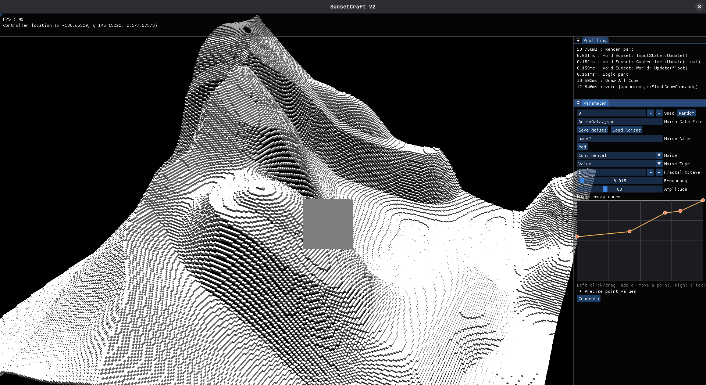
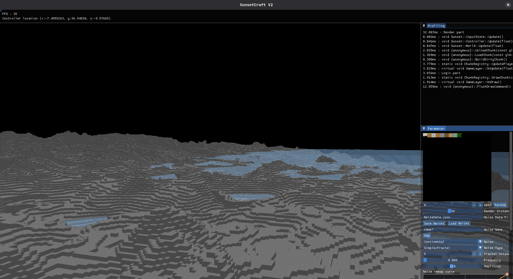
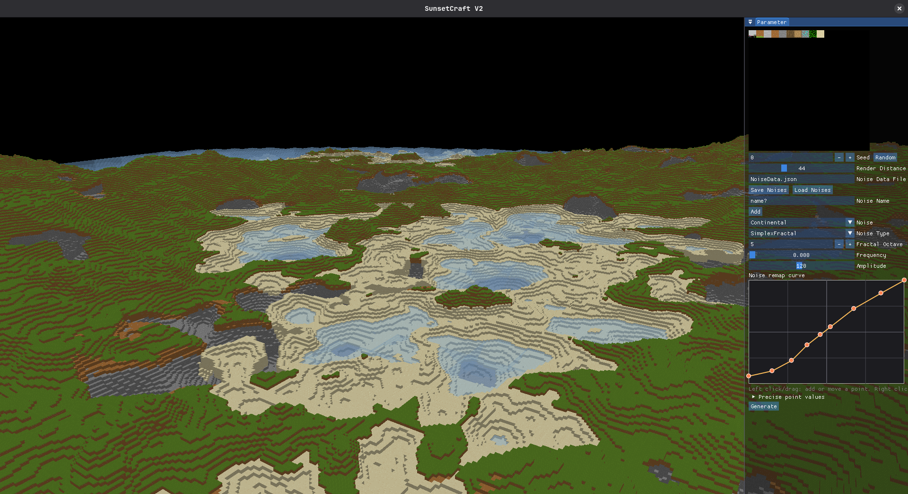
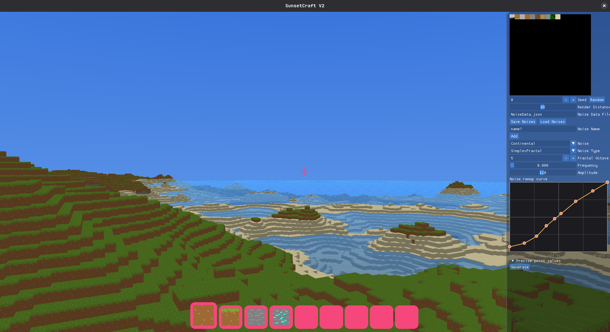
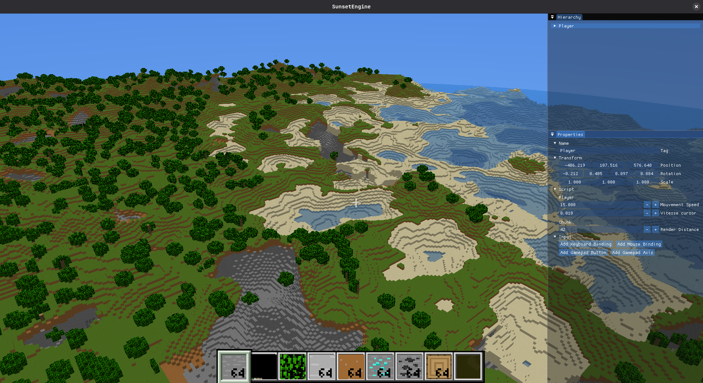

# SunsetCraft V2

> Prototype voxel en C++/OpenGL inspiré de Minecraft, développé pour expérimenter la génération de monde, le rendu et l'intégration progressive avec SunsetEngine.


---
## Aperçu








---

## Présentation

SunsetCraft V2 est une réécriture de [SunsetCraft](https://github.com/SunvyWasTaken/SunsetCraft). Le but est de repartir d'une base plus propre sans modifier la première version, puis de tester :

- une génération de monde plus expressive, inspirée de la conférence de Henrik Kniberg [Reinventing Minecraft world generation](https://youtu.be/ob3VwY4JyzE) ;
- un éditeur ImGui pour régler les paramètres de génération directement en jeu ;
- un rendu voxel simple avec ciel, eau animée, inventaire et interaction bloc par bloc ;
- une base réseau locale avec ENet, encore expérimentale ;
- l'intégration progressive avec [`SunsetEngine`](https://github.com/SunvyWasTaken/SunsetEngine), utilisé comme sous-module Git.

---

## Fonctionnalités actuellement présentes

- Menu principal avec les actions `Play`, `New World` et `Quit`.
- Création/chargement d'un monde local avec sauvegarde du paramètre de monde dans `GameSaved.bin`.
- Génération de chunks autour de la position du joueur.
- Chargement/déchargement des chunks selon la distance de rendu.
- Génération asynchrone des chunks sur plusieurs threads.
- Sauvegarde périodique des chunks modifiés et restauration depuis les fichiers de sauvegarde.
- Sauvegarde/restauration de la dernière position du joueur.
- Génération de terrain à partir de couches `FastNoiseSIMD` chargées depuis `NoiseData.json`.
- Passes de génération pour la hauteur, la surface, l'eau, les arbres, les caves et les minerais.
- Registres de blocs et d'items chargés depuis les fichiers JSON du dossier `Save`.
- Rendu OpenGL des chunks avec frustum culling.
- Rendu du ciel et animation temporelle de l'eau.
- Interface en jeu avec viseur, inventaire et barre rapide.
- Déplacement libre du joueur avec caméra à la première personne.
- Initialisation d'un hôte ENet local au lancement d'une partie, utilisé comme base de travail réseau.

---

## État du projet

Le projet est un prototype en développement actif. Les points suivants sont volontairement indiqués pour éviter de présenter le projet comme plus avancé qu'il ne l'est :

- le gameplay est encore orienté exploration et validation technique ;
- la pose/destruction de blocs par clic est présente dans le code, mais actuellement désactivée dans le flux de jeu ;
- l'éditeur ImGui de génération n'est pas branché dans cette version ;
- l'ancienne fenêtre de test réseau/chat existe encore dans le code, mais n'est pas intégrée au parcours principal ;
- le multijoueur complet et la réplication du monde ne sont pas encore implémentés ;
- l'exécutable serveur headless n'est pas généré par le CMake actuel ;
- la distance de rendu est réduite automatiquement en configuration Debug afin de faciliter les tests ;
- certains systèmes restent expérimentaux et peuvent évoluer rapidement.

---

## Contrôles

| Action                      | Touche  |
|-----------------------------|:-------:|
| Avancer                     |   `W`   |
| Reculer                     |   `S`   |
| Aller à gauche              |   `A`   |
| Aller à droite              |   `D`   |
| Monter                      |   `E`   |
| Descendre                   |   `Q`   |
| Afficher/masquer le curseur | `Échap` |

---

## Technologies

- C++20
- CMake 3.28+
- OpenGL
- GLFW / GLAD
- GLM
- ImGui avec docking expérimental
- ENet
- EnTT
- nlohmann-json
- spdlog
- assimp
- stb, via SunsetEngine
- vcpkg en mode manifest
- [`SunsetEngine`](https://github.com/SunvyWasTaken/SunsetEngine) comme sous-module Git

---

## Prérequis

Avant de compiler, installez :

- un compilateur compatible C++20 ;
- CMake `3.28` ou plus récent ;
- Git ;
- vcpkg ;
- les dépendances graphiques nécessaires à OpenGL sur votre système ;
- Visual Studio, CLion ou un autre IDE compatible CMake si vous préférez travailler avec une interface graphique.

> Sur Windows, Visual Studio avec la charge de travail C++ est recommandé.

---

## Installation

### 1. Cloner le projet avec ses sous-modules

```bash
git clone --recurse-submodules <repo-url> SunsetCraft_V2
cd SunsetCraft_V2
```

Si le projet a été cloné sans le sous-module [`SunsetEngine`](https://github.com/SunvyWasTaken/SunsetEngine), lancez :

```bash
git submodule update --init --recursive
```

### 2. Préparer vcpkg

Suivez la documentation officielle Microsoft : [Get started with vcpkg](https://learn.microsoft.com/en-us/vcpkg/get_started/get-started-vs?pivots=shell-cmd).

Exemple d'installation locale à côté du projet :

```bash
git clone https://github.com/microsoft/vcpkg.git
```

Windows :

```bat
vcpkg\bootstrap-vcpkg.bat
```

Linux / macOS :

```bash
./vcpkg/bootstrap-vcpkg.sh
```

### 3. Configurer CMake

Remplacez le chemin du toolchain vcpkg par celui qui correspond à votre installation.

Windows :

```bat
cmake -S . -B Build -DCMAKE_TOOLCHAIN_FILE=%CD%\vcpkg\scripts\buildsystems\vcpkg.cmake
```

Linux / macOS :

```bash
cmake -S . -B Build -DCMAKE_TOOLCHAIN_FILE=$PWD/vcpkg/scripts/buildsystems/vcpkg.cmake
```

### 4. Compiler

```bash
cmake --build Build --config Debug
```

Pour une version Release :

```bash
cmake --build Build --config Release
```

---

## Lancer le jeu

Après compilation, lancez l'exécutable `SunsetCraftV2` généré dans le dossier `Build`.

Depuis le menu principal :

1. cliquez sur `Play` pour démarrer une session locale ;
2. utilisez la fenêtre `Parameter` pour ajuster la seed, la distance de rendu et les paramètres de génération ;
3. utilisez l'inventaire et la barre rapide pour sélectionner un bloc ;
4. cassez un bloc avec le clic gauche et placez le bloc sélectionné avec le clic droit.

Pour lancer le serveur headless généré par CMake, utilisez l'exécutable `SunsetCraftV2_Server`.

---

## Données modifiables

Les fichiers du dossier `Save` servent de configuration de prototype :

- `NoiseData.json` : preset de génération chargé par défaut ;
- `BlockReg.json` : registre des blocs et textures associées ;
- `Item.json` : registre des items ;
- `Inputs.json` / `Input.json` : exemples de mapping d'entrées selon la configuration moteur ;
- `imgui.ini` : état des fenêtres ImGui.

---

## Licence

Ce dépôt inclut un fichier `LICENSE`. Consultez-le avant de distribuer ou réutiliser le jeu.
